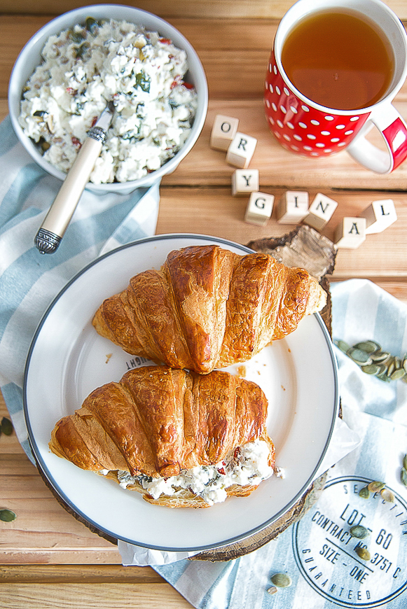
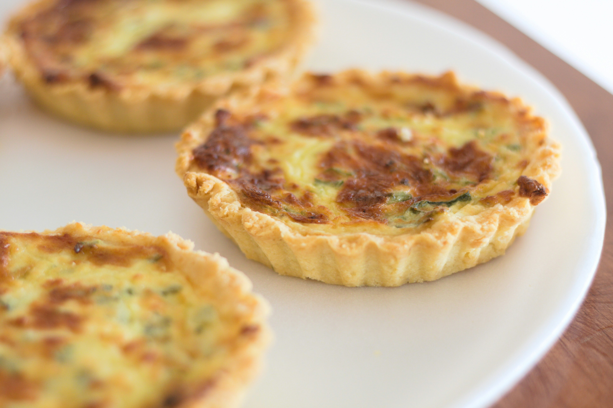
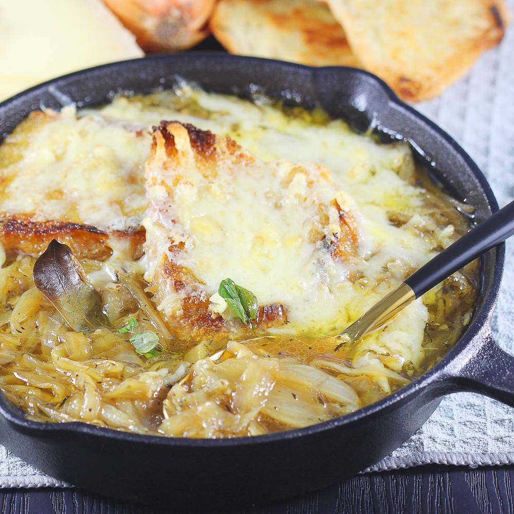
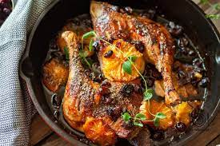
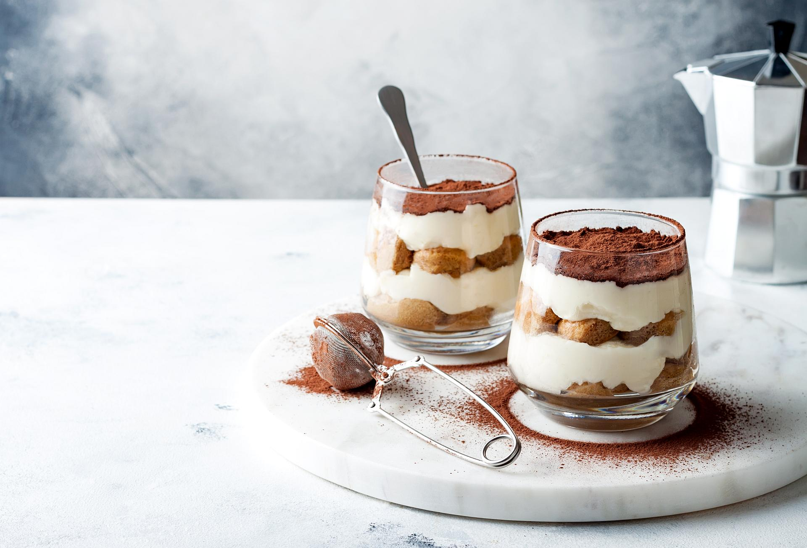
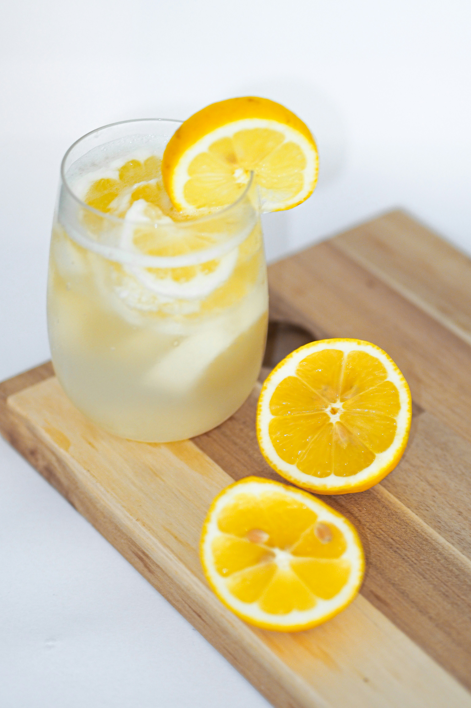

# Menu

## Breakfast Menu

### Sandwiches and Croissants

- Croissant with cottage cheese, radish, and soft-boiled egg 35zł
- Croissant with Parma ham and arugula 35zł
- French toast with sweet toppings 30zł

## Lunch Menu

### Snacks

- Crispy quiche - 19zł
- "Ptasie mleczko" with herbal cream - 19zł

### Soups
- Onion soup 25zł
- Broth 19zł
- Asparagus soup 25zł

### Main Courses
- Duck leg 45zł
- Rabbit ragout  55zł
- Lamb with vegetable navarin 75zł
- Boeuf Bourguignon 75zł

- Ratatouille 45zł
- Carrot and beetroot stew 45zł
- Zucchini steak 55zł

## Desserts

- Tiramisu 25zł
- Creme brulee 25zł
- Tart with seasonal fruits - 35zł

## Beverages

- Lemonade 19zł
- Fruit juices 10zł
- Carbonated drinks  10zł
- Water 7zł
 

### White Wines

|Lp.|Variety	        |Origin      |15cl  |75cl |
|---|----------------|------------|------|-----|
|1. |Chardonnay      |Australia   |15zł  |60zł |
|2. |Sauvignon Blanc |France      |19zł  |75zł |
|3. |Riesling        |Germany     |19zł  |75zł |
|4. |Pinot Grigio    |Italy       |25zł  |85zł |

### Red Wines

|Lp.|Variety	          |Origin      |15cl  |75cl |
|---|------------------|------------|------|-----|
|1. |Merlot            |Chile       |19zł  |75zł |
|2. |Cabernet Sauvignon|France      |25zł  |85zł |
|3. |Pinot Noir        |France      |25zł  |85zł |
|4. |Shiraz            |Italy       |29zł  |90zł |
