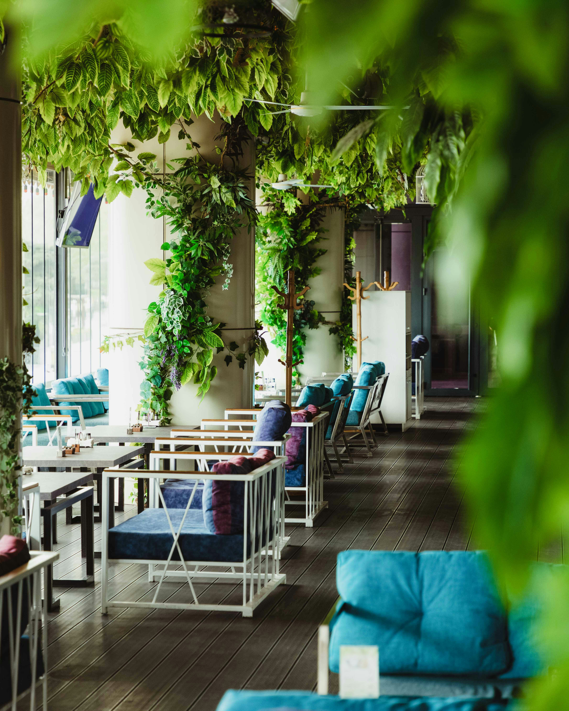

# Opis Restauracji

Witaj w "La Belle Cuisine" – naszej urokliwej restauracji, gdzie zapraszamy Cię w podróż przez smaki i aromaty Francji. Nasze eleganckie wnętrze, nawiązujące do stylu francuskiej prowincji, tworzy atmosferę pełną uroku i wyrafinowania.

Rozpocznij swoją kulinarzną podróż od tradycyjnych francuskich przekąsek, takich jak delikatne ptasie mleczko z kremem ziołowym lub kruche quiche z lokalnymi składnikami. Nasze menu oferuje również szeroki wybór wykwintnych dań głównych, które zadowolą nawet najbardziej wymagających smakoszy. Spróbuj naszej klasycznej boeuf bourguignon, gdzie soczyste kawałki wołowiny duszone są w czerwonym winie z dodatkiem świeżych ziół i warzyw, lub delektuj się wyrafinowanym smakiem kaczki w pomarańczowym sosie.

Nasi kucharze starannie dobierają składniki, dbając o najwyższą jakość i autentyczność każdego dania. Każdy posiłek w "La Belle Cuisine" to prawdziwa uczta dla zmysłów, której niezapomniane wrażenia pozostaną z Tobą na długo po opuszczeniu naszej restauracji.

Nie zapomnij zakończyć swojej podróży po francuskich smakach odrobiną słodkości z naszego bogatego menu deserów. Od klasyki jak crème brûlée po lekkie tarty z owocami sezonowymi – każdy kęs będzie prawdziwą ucztą dla podniebienia.

Czekamy na Ciebie w "La Belle Cuisine", abyś mógł doświadczyć prawdziwej francuskiej gościnności i delektować się wyjątkowymi smakami kuchni tego pięknego kraju.

   

