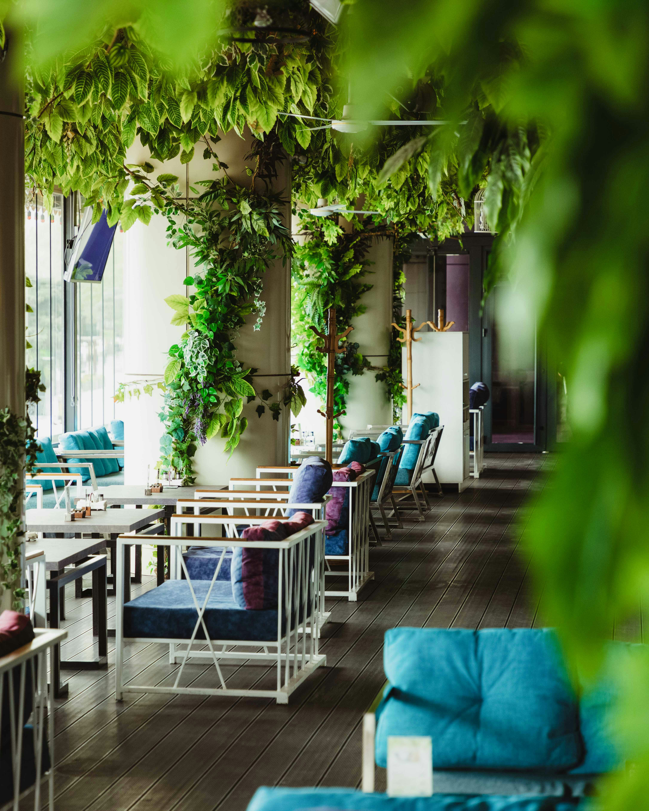

# Restaurant Description

Welcome to "La Belle Cuisine" - our charming restaurant, where we invite you on a journey through the flavors and aromas of France. Our elegant interior, reminiscent of the style of the French countryside, creates an atmosphere full of charm and refinement.

Start your culinary journey with traditional French snacks, such as delicate bird's milk with herbed cream or crispy quiche with local ingredients. Our menu also offers a wide selection of exquisite main courses that will satisfy even the most discerning palate. Try our classic beef bourguignon, where juicy pieces of beef are stewed in red wine with the addition of fresh herbs and vegetables, or indulge in the refined taste of duck in orange sauce.

Our chefs carefully select ingredients, ensuring the highest quality and authenticity of each dish. Every meal at "La Belle Cuisine" is a true feast for the senses, and the unforgettable experiences will stay with you long after you leave our restaurant.

Don't forget to end your journey through French flavors with a touch of sweetness from our rich dessert menu. From classics like crème brûlée to light tarts with seasonal fruits - every bite will be a true delight for the palate.

We await you at "La Belle Cuisine" to experience true French hospitality and savor the unique flavors of the cuisine of this beautiful country.

   

